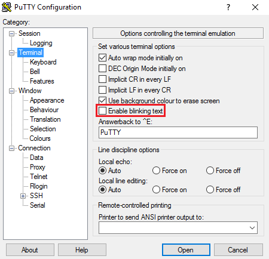

# Arduino serial monitor extention
This is a small library which extent the ```Serial``` class in Arduino.

**Table of Contents**
- [Intension](#intention)
- [ANSI/VT100 Terminal Control Escape Sequences](#ansivt100-terminal-control-escape-sequences)
- [Requirements](#requirements)
- [How to install Arduino libraries](#how-to-install-arduino-libraries)
- [Terminal Settings](#terminal-settings)
- [Example](#example)
- [LICENSE](#license)


## Intention
I wanted to program a little Pin overview for the AAR-04 AREXX ARDUINO ROBOT which I lent me out. The Pin overview should look like this:


Every X seconds the values should be refreshed. For this I intentional refresh the hole table. Not nice but should work was what I thought. Unfortunately, the buffer was not big enough and not the hole table was printed. The result was that I only print the table structure and update only the values. To realize this, I wrote this library. Due to this lirary I am able set the courser to the right place and override the old values.

The Pin overview program could be found [here](https://github.com/HeinrichAD/Arduino-PinOverview).


## ANSI/VT100 Terminal Control Escape Sequences
Many computer terminals and terminal emulators support colour and cursor control through a system of escape sequences. One such standard is commonly referred to as ANSI Colour. Several terminal specifications are based on the ANSI colour standard, including VT100.

This library based on "[ANSI/VT100 Terminal Control Escape Sequences](http://www.termsys.demon.co.uk/vtansi.htm)", and an ASCII table for further methods.


## Requirements
The serial monitor from the arduino IDE does not support everything.

I recommend for a nearly full support [PuTTY](http://www.chiark.greenend.org.uk/~sgtatham/putty/download.html) for Windows user.


## How to install Arduino libraries
For information on installing libraries, see the Guide "[Installing Additional Arduino Libraries](http://www.arduino.cc/en/Guide/Libraries)".

In short, copy the library files to your library folder, restart your Arduino IDE and add the library.


## Terminal Settings
Many terminals like [PuTTY](http://www.chiark.greenend.org.uk/~sgtatham/putty/download.html) have different settings avalible and different defaults. If something is not working, you should look in the terminal settings if you are able enable the support. If there isn't a settings for this then you should look if the terminal support this anyway.

_Example:_ [PuTTY](http://www.chiark.greenend.org.uk/~sgtatham/putty/download.html) can support blinking text, but it is disabled by default:




## Example
The following little example can be also found here: ```/examples/SerialExamples.ino```.

A better and maybe a little bit more complex example is the project which I mentioned in the intention. This project could be found [here](https://github.com/HeinrichAD/Arduino-PinOverview).
```c++
#include <SerialExtended.h>

// Baudrate for serial monitor.
#define SERIAL_BAUD 9600


void setup() {
  // put your setup code here, to run once:
  // set up the serial port
  Serial.begin(SERIAL_BAUD);
}


void loop() {
  // put your main code here, to run repeatedly:
  if (Serial.available()) {
  	// Read user string
    String text = Serial.readString();

    // Set terminal attributes
    SuperSerial.SetAttributeMode(2, 41, 5);
    // or
    //SuperSerial.SetAttributeMode(41); // Red background color
    //SuperSerial.SetAttributeMode(5);  // Text blink
    // or
    //SuperSerial.SetAttributeMode(SerialExtended::DisplayAttributes::B_Red);
    //SuperSerial.SetAttributeMode(SerialExtended::DisplayAttributes::Blink);
    // or 
    //SuperSerial.SetAttributeMode(SuperSerial.DisplayAttributes::B_Red);
    //SuperSerial.SetAttributeMode(SuperSerial.DisplayAttributes::Blink);
    // or
    //SuperSerial.SetAttributeMode(2, SuperSerial::DisplayAttributes::B_Red, SerialExtended::DisplayAttributes::Blink);
    // or 
    //SuperSerial.SetAttributeMode(2, SuperSerial.DisplayAttributes::B_Red, SuperSerial.DisplayAttributes::Blink);
    // or
    // ...

    // Output user string
    Serial.print("Com: ");
    Serial.println(text);

    // Output some ASCCI charaters
    SuperSerial.SendASCIICode(65); // A
    SuperSerial.NewLine();
    SuperSerial.SendASCIICode(3, 65, 66, 67); // A, B, C
    SuperSerial.NewLine();

    // Reset all terminal attributes
    SuperSerial.SetAttributeMode(0);

    // Wait a little (0.5 seconds)
    delay(500);

    // Write 999 and change it to 777
    Serial.print(999);
    delay(1000); // Wait a little more (1 second)
    SuperSerial.Backspace(3);
    Serial.println(777);

    SuperSerial.NewLine();
  }
}
```


## LICENSE
GNU General Public License v3.0<br />
For more information see [LICENSE](/LICENSE) file.
